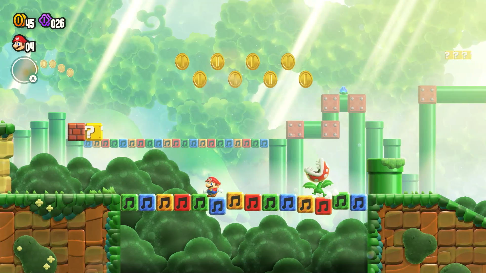
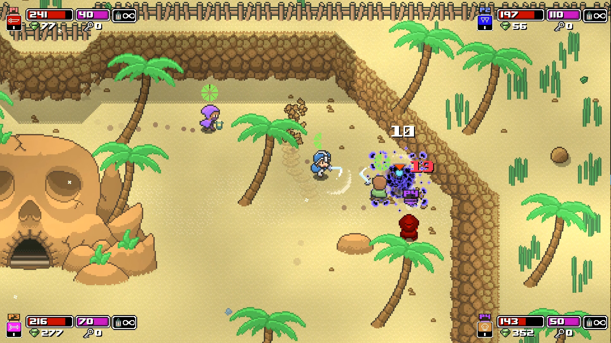
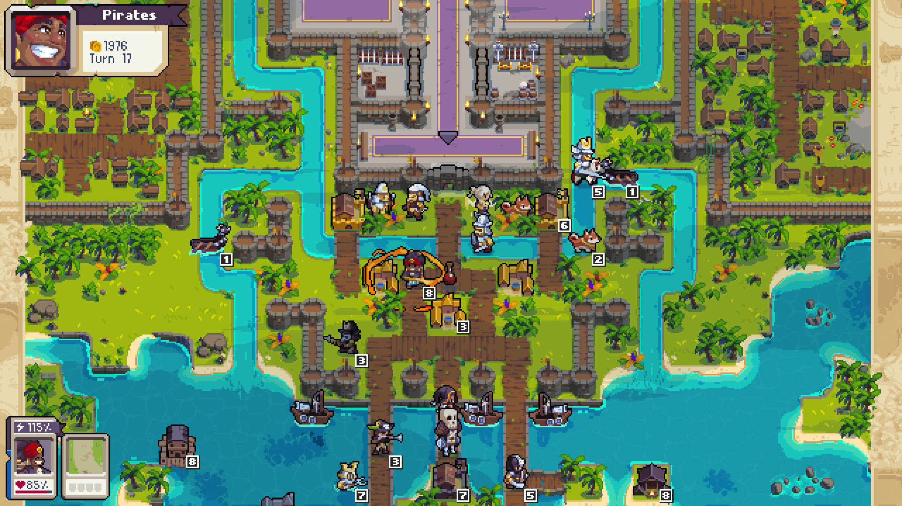
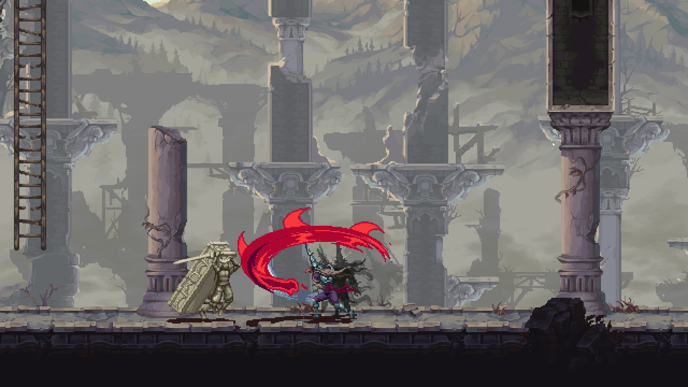
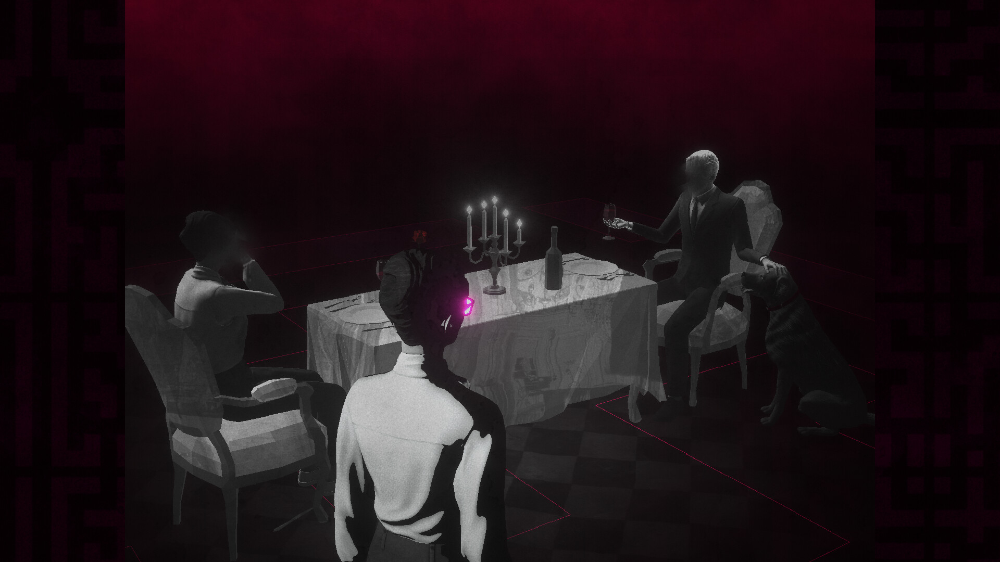
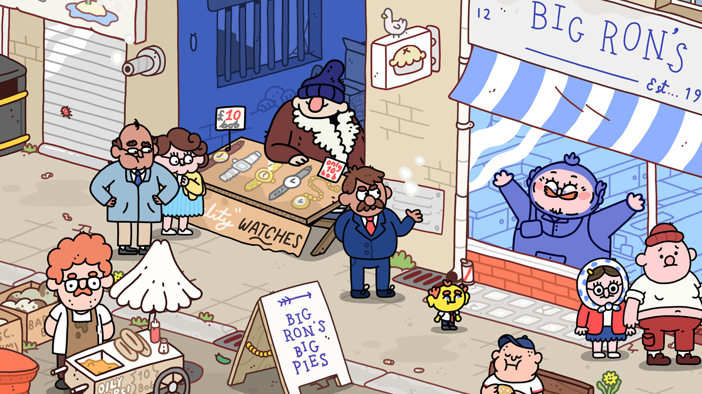

# Nintendo Switch Games Showcase

## Cooperative Multiplayer Games
*Games that support multiple players playing together simultaneously*

### Super Mario Bros. Wonder

- **Genre**: 2D Platformer, Action
- **Length**: 10-15 hours
- **Tag**: CO-OP
- **Mechanics**: Wonder flower transformations, Character abilities, Badge system, Wonder effects, Secret levels
- **Multiplayer**: Local co-op (4 players)
- **Description**: Super Mario Bros. Wonder brings fresh innovation to the 2D Mario format with the introduction of Wonder Flowers that transform levels in surprising and unpredictable ways. Mario might turn into an elephant, pipes might come alive, or the entire perspective could shift. The game features multiple playable characters including Mario, Luigi, Peach, Daisy, and various Toads and Yoshis, each with subtle differences in ability. The new badge system allows players to equip special powers like wall-jumping or grappling hooks to customize their playstyle. With multiple worlds to explore and numerous secret levels to discover, the game offers substantial replay value, especially when played cooperatively with friends.

### Rogue Heroes: Ruins of Tasos

- **Genre**: Action RPG, Roguelite
- **Length**: 15-20 hours
- **Tag**: CO-OP
- **Mechanics**: Procedural dungeons, Village building, Character classes, Ability upgrades
- **Multiplayer**: Local co-op (up to 4 players)
- **Description**: Rogue Heroes: Ruins of Tasos combines roguelite elements with town-building and classic Zelda-inspired dungeon crawling. Players explore procedurally generated dungeons filled with monsters, traps, and puzzles while collecting gems that can be used to rebuild and upgrade their village hub. The village improvements in turn unlock new character classes, abilities, and items for future dungeon runs. With multiple character classes to master and the ability to switch between them, the game offers variety in playstyles from heavy-hitting warriors to ranged mages. The entire adventure can be played cooperatively, with dungeons scaling in difficulty to match the number of players.

### Wargroove 2

- **Genre**: Turn-Based Strategy, Tactical
- **Length**: 25-35 hours
- **Tag**: CO-OP
- **Mechanics**: Commander powers, Unit management, Campaign creation, Faction differences, Co-op campaign
- **Multiplayer**: Local multiplayer (up to 4 players), Co-op campaign (2 players)
- **Description**: Wargroove 2 expands on its predecessor's pixel-art turn-based strategy gameplay with new factions, commanders, and game modes. The game features three distinct campaigns following different factions in a fantasy world of warring kingdoms. A key mechanic is the 'groove' system where commanders build up power during battle to unleash special abilities that can turn the tide of war. The sequel introduces the 'Conquest' system, a roguelike mode where players make strategic choices along branching paths. Additional features include a robust level editor for creating custom maps and campaigns, and various multiplayer options including a co-op campaign designed specifically for two players. With its charming art style and deep tactical gameplay, Wargroove 2 appeals to fans of classic strategy games like Advance Wars.

### Into the Breach

- **Genre**: Turn-Based Strategy, Roguelike
- **Length**: 10-15 hours for first victory
- **Tag**: CO-OP
- **Mechanics**: Grid-based combat, Future attack telegraphing, Mech customization, Timeline manipulation
- **Multiplayer**: Local co-op (shared controls)
- **Description**: Into the Breach is a refined tactical strategy game from the creators of FTL. Players control a squad of time-traveling mechs sent to combat an alien threat called the Vek. The game takes place on small grid-based maps where every enemy move is telegraphed one turn in advance, turning each battle into a precise puzzle. The goal isn't just to defeat enemies but to protect civilian buildings, as their destruction lowers the power grid which serves as your overall health bar. Each run features procedurally generated challenges across different islands, and when defeat is inevitable, one pilot can be sent back in time to start a new timeline with their experience intact. With multiple unlockable mech squads that completely change playstyle, the game offers tremendous strategic depth in a deceptively compact package.

## Pass-and-Play Games
*Games perfect for taking turns with friends, each controlling during different sections*

### Blasphemous 2

- **Genre**: Metroidvania, Soulslike
- **Length**: 15-20 hours
- **Tag**: PASS & PLAY
- **Mechanics**: Weapon-based abilities, Penitence system, Punishing combat, Religious imagery, Skill trees
- **Multiplayer**: No local multiplayer
- **Description**: Blasphemous 2 continues the dark and brooding saga of The Penitent One in a brutal action platformer set in a nightmarish world filled with religious iconography and Gothic horror. The game features three main weapons, each with distinctive play styles and upgrade paths. Players navigate through non-linear environments, solving puzzles and defeating challenging bosses while uncovering the twisted lore of Cvstodia. The combat is deliberate and punishing, rewarding precision and patience while penalizing mistakes harshly.

### Tails of Iron

- **Genre**: Action RPG, Soulslike
- **Length**: 10-15 hours
- **Tag**: PASS & PLAY
- **Mechanics**: Stamina-based combat, Equipment load, Dodge/block/parry, Cooking, Quest system
- **Multiplayer**: No local multiplayer
- **Description**: Tails of Iron is a challenging hand-drawn RPG adventure set in a grim world populated by anthropomorphic animals. Players take on the role of Redgi, heir to the Rat Throne, who must rebuild his kingdom after a devastating attack by the merciless Frog Clan. The combat system requires careful timing with dodges, parries, and strikes while managing stamina. Players can collect various weapons and armor with different attributes and effects. The game features a cooking system for creating helpful consumables and a quest-based progression structure, all narrated with grim whimsy by Doug Cockle (known for his role as Geralt in The Witcher).

### ANIMAL WELL

- **Genre**: Metroidvania, Puzzle Platformer
- **Length**: 6-10 hours
- **Tag**: PASS & PLAY
- **Mechanics**: Ability-based progression, Environmental puzzles, Hidden secrets, Surreal environments
- **Multiplayer**: No local multiplayer
- **Description**: ANIMAL WELL is a meticulously crafted puzzle-platformer with an emphasis on discovery and exploration. Set in a mysterious, labyrinthine well filled with animal spirits, the game combines tight platforming controls with inventive puzzle design. Players gradually acquire new tools and abilities that let them interact with the environment in increasingly complex ways. The surreal pixel art creates an otherworldly atmosphere as players delve deeper into the well, uncovering its secrets. The game is designed with multiple layers of hidden content, rewarding observant players who take the time to experiment and thoroughly explore its interconnected spaces.

## Narrative Experiences
*Story-rich games to experience together like an interactive movie*

### Lorelei and the Laser Eyes

- **Genre**: Puzzle, Mystery
- **Length**: 10-15 hours
- **Tag**: STORY
- **Mechanics**: Environmental puzzles, Perspective manipulation, Hidden clues, Non-linear exploration
- **Multiplayer**: No local multiplayer
- **Description**: Lorelei and the Laser Eyes is a surreal mystery puzzle game from the creators of Sayonara Wild Hearts. Set in a mysterious central European hotel-turned-museum, players follow a woman named Lorelei who's been invited to the estate to solve a series of enigmatic puzzles. The game features striking black and white visuals with occasional splashes of color, creating an eerie atmosphere inspired by European cinema. Gameplay involves exploring the non-linear environment, deciphering cryptic symbols, manipulating objects, and solving interconnected puzzles that often require thinking outside the box. The narrative unfolds in a dreamlike, fragmented manner that adds to the game's mysterious allure.

### Once Upon A Jester

- **Genre**: Adventure, Comedy, Performance
- **Length**: 3-5 hours
- **Tag**: STORY
- **Mechanics**: Improvisation mechanics, Musical performances, Character interactions, Humor-focused
- **Multiplayer**: No local multiplayer
- **Description**: Once Upon A Jester is a colorful and whimsical adventure game that follows the journey of two friends, Jester and Sok, who devise a plan to steal the Royal Diamond by becoming famous theater performers. Players travel from town to town putting on improvised plays, where success depends on reading the audience and adapting performances to their tastes. The game features musical performances, quirky character interactions, and a charming hand-drawn art style. With its emphasis on humor and character-driven storytelling, the short but sweet adventure offers a joyful experience focused on creativity and friendship rather than traditional puzzle-solving or combat.

### Thank Goodness You're Here!

- **Genre**: Comedy, Adventure, Narrative
- **Length**: 5-7 hours
- **Tag**: STORY
- **Mechanics**: Absurdist humor, Environmental interactions, Improvisation, NPC reactions
- **Multiplayer**: No local multiplayer
- **Description**: Thank Goodness You're Here! is a comedy adventure game with a unique premise: you're always the right person in the wrong place. Each level begins with someone exclaiming the title phrase and immediately putting you to work as if you're exactly who they've been waiting for, whether that's a firefighter, a chef, or something far more bizarre. The game embraces absurdist humor and improvisation as you navigate increasingly surreal situations using whatever objects you can find. The distinctive art style combines 2D characters with 3D environments, and the game rewards experimentation with hilarious NPC reactions to your actions. Rather than traditional puzzles with single solutions, the game encourages creative approaches to each scenario.
